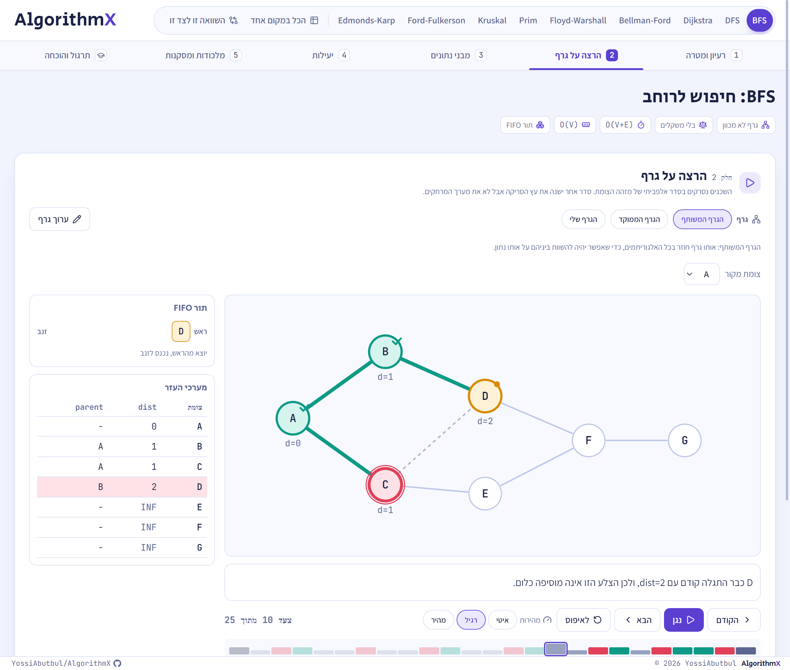
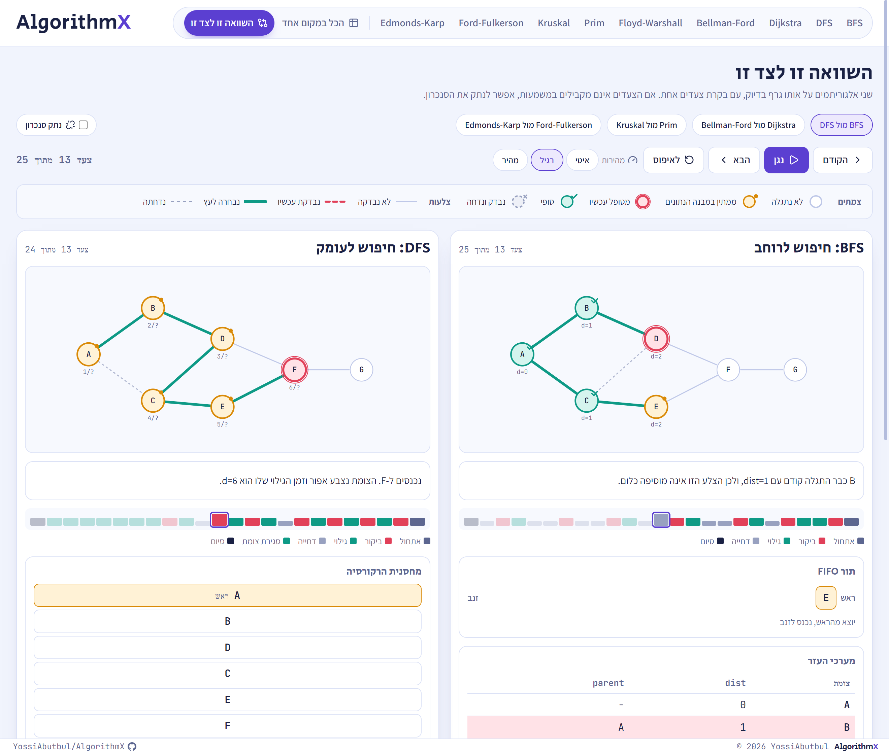
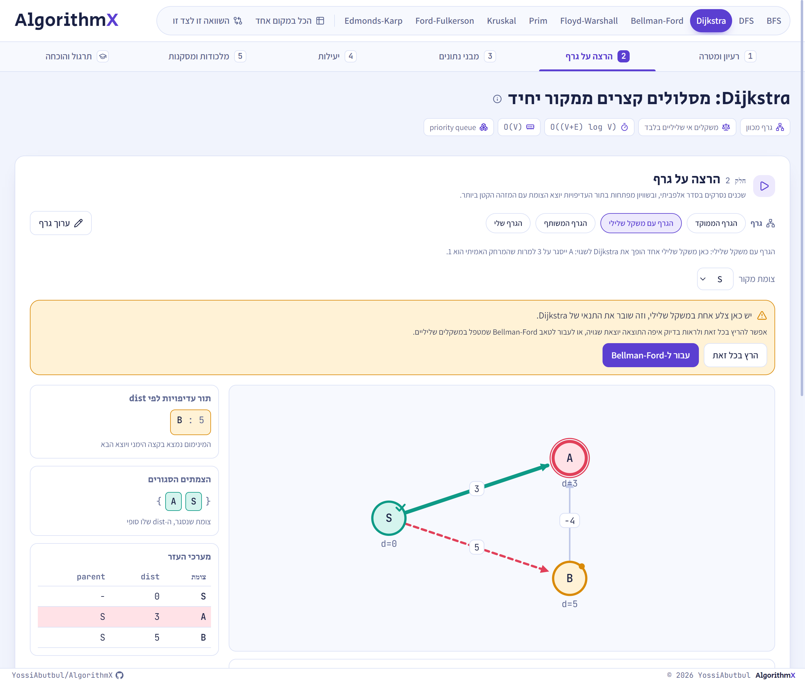
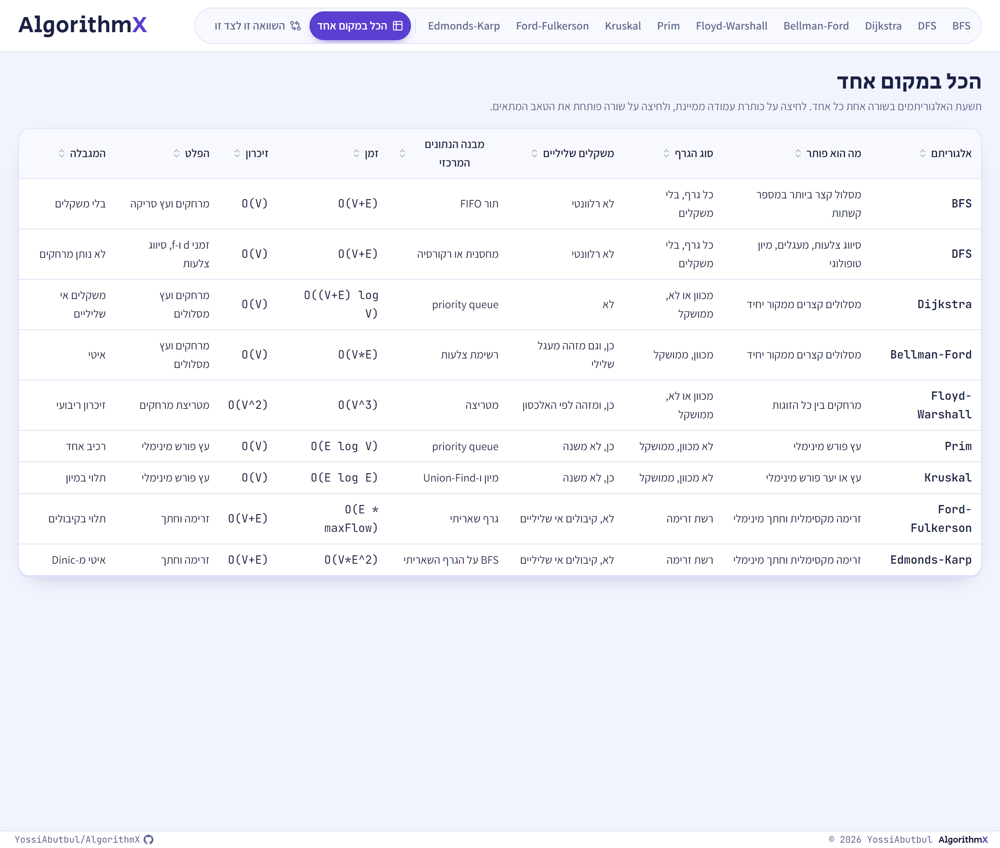
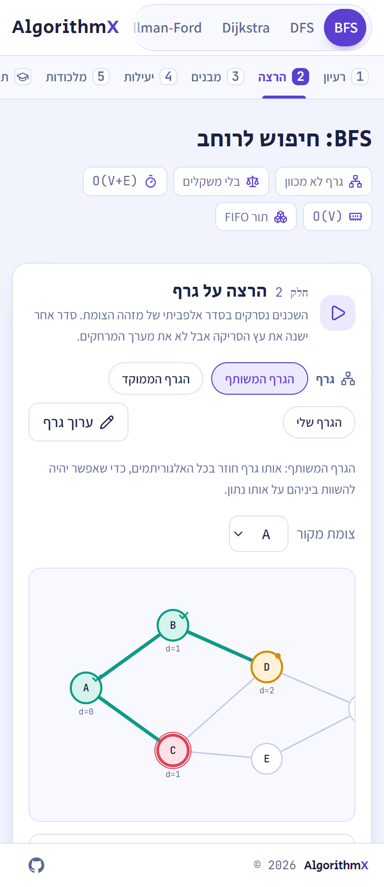

# AlgorithmX

**Nine graph algorithms, one step at a time.**

An interactive Hebrew learning site that turns graph algorithms from something you memorize into
something you watch happen. Press play and follow the algorithm as it colors the graph, fills the
queue, updates the distance array and closes in on the answer.

**[Open the site](https://algorithmx.abyossi22.workers.dev/)**



---

## What you get

**See the algorithm run, not just its result.**
Every step colors the node and the edge that changed, and explains in one sentence what just
happened and why. Step forward, step back, jump anywhere, or let it play at your own pace.

**Watch the data structures fill up.**
The queue, the stack, the priority queue, the distance array, the matrix, the sorted edge list, the
Union-Find groups and the flow table all update alongside the graph. Hover a row and the matching
node lights up.

**The step timeline.**
A thin bar under the graph where every step is a mark, colored by what happened: a discovery, an
improvement, a rejection, an augmentation. You can see the whole rhythm of the algorithm at a
glance, and drag along it to travel through time. Put two timelines side by side and the difference
between two algorithms becomes obvious before you read a single line.

**Compare two algorithms on the same graph.**
Four prepared pairs, each teaching one specific thing:

- BFS against DFS: a wide tree against a deep one
- Dijkstra against Bellman-Ford: exactly where Dijkstra locks in a wrong answer
- Prim against Kruskal: two build orders, the same total weight
- Ford-Fulkerson against Edmonds-Karp: four iterations against two



**Know when an algorithm is the wrong tool.**
Feed Dijkstra a negative edge and the site does not hide it. It warns you, offers to switch to
Bellman-Ford, and if you run it anyway you watch it close a node on the wrong value and never
come back to fix it.



**Build your own graph.**
Add nodes, drag them, connect them, set weights. Save it to your browser, export it as JSON, share
it, and run any of the nine on it.

**Practice like it is an exam.**
Every algorithm ships with pitfalls, an exam tips box, and practice questions with revealed
solutions. Pseudocode and correctness proofs are one click away, hidden by default so the screen
stays calm.

---

## The nine

| Algorithm | Solves | Time |
| --- | --- | --- |
| BFS | Shortest path in number of edges | `O(V+E)` |
| DFS | Edge classification, cycles, topological sort | `O(V+E)` |
| Dijkstra | Shortest paths from one source | `O((V+E) log V)` |
| Bellman-Ford | Shortest paths with negative weights | `O(V*E)` |
| Floyd-Warshall | Shortest paths between all pairs | `O(V^3)` |
| Prim | Minimum spanning tree, growing one tree | `O(E log V)` |
| Kruskal | Minimum spanning tree, sorting edges | `O(E log E)` |
| Ford-Fulkerson | Maximum flow and minimum cut | `O(E * maxFlow)` |
| Edmonds-Karp | Maximum flow with a bound that holds | `O(V*E^2)` |

They are ordered by what you need to know first, and every tab tells you which one that is.



## On a phone

The same site, with the graph large enough to read and the whole run still one thumb away.



---

## Built to be trusted

Every algorithm is a pure function: give it a graph, get back the full list of steps. Nothing is
animated by hand, so what you see is what the algorithm actually did.

Every choice the algorithm makes freely, such as the order of neighbors or how ties are broken, is
fixed and stated on screen. That is usually the exact detail an exam question turns on.

A test suite pins the expected result of all nine, including one test that deliberately preserves
Dijkstra returning the wrong answer on a negative edge, so the teaching example can never quietly
break.

---

## Run it yourself

```bash
npm install
npm run dev
```

Other commands:

```bash
npm run build    # static site into dist
npm test         # run the test suite
npm run verify   # style check, types and tests together
```

No backend, no database, no accounts. The build is a folder of static files you can host anywhere.

---

## Under the hood

Vite, React and TypeScript, styled with Tailwind. The graph rendering is hand written SVG: no
charting library, no animation library, no dependencies beyond React and an icon set.

Adding a tenth algorithm means writing a `run(graph)` function that returns steps, a content file
with the Hebrew text, and one line in the registry. See `src/algorithms/bfs.ts` for the smallest
complete example.

### Writing rules for contributors

- Never use the em-dash or en-dash characters anywhere in the project, including commit messages.
  Use a regular hyphen, a comma or a separate sentence. `npm run check:dashes` fails the build if
  one slips in.
- Interface text is Hebrew, code and identifiers are English.
- Algorithm names, data structure names and complexity notation stay in English inside Hebrew text.

---

Built by [YossiAbutbul](https://github.com/YossiAbutbul).
